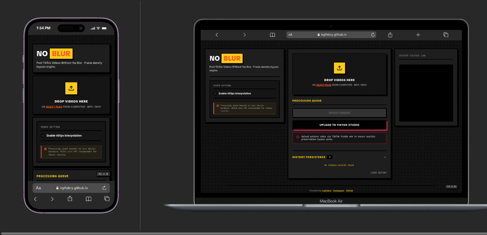

# NoBlur — Post TikTok Videos Without the Blur

NoBlur is a premium, client-side web application that processes MP4 and MOV video containers locally directly in your browser to bypass aggressive server-side recompression when uploading to TikTok. It uses MP4 sample-table frame density inflation as its core bypass mechanism, with optional 60fps VFI interpolation and HDR10 conversion pipelines. The result preserves original quality, visual fidelity, and audio-video synchronization.

All processing is performed client-side using JavaScript, ArrayBuffers, Blobs, and FFmpeg.wasm. No data is uploaded to external servers.



---

## Technical Architecture

NoBlur runs four pipeline combinations depending on toggles.

### Non-Interpolation Path (Frame Density Inflation)

The primary path for bypassing TikTok recompression. It inflates the MP4 sample table using pure binary manipulation — no FFmpeg re-encode, preserving 100% video quality with 10-100x faster processing.

1. **Container Normalization:** Ensures optimal MP4 structure with `moov` atom before `mdat` (fast-start) and rewrites `ftyp` brand to "isom" for maximum compatibility.
2. **Frame Density Inflation:** Inflates the sample table by 10x multiplier. Real frames are kept; codec-aware dummy samples are appended with `stts`/`stsz`/`stco`/`stsc` patched and padding written at EOF. Supports VFR (variable frame rate), 64-bit chunk offsets (co64), and per-codec dummy sizes (avc1/avc3: 8B, hvc1/hev1: 16B, vp09/av01: 4B). TikTok reads the inflated frame count as high-density content and skips heavy recompression.

### Interpolation Path (60fps VFI)

When only the Interpolation toggle is enabled, FFmpeg.wasm is lazy-loaded to run motion-compensated frame interpolation (`minterpolate`) to 60fps. The output is H.264 8-bit (libx264, preset fast, CRF 20) with selectable output resolution (1080p or 2K). Audio is copied without re-encoding (`-c:a copy`). The interpolated video is then passed through the same frame density inflation pipeline described above to ensure TikTok bypass compatibility.

### HDR10 Path (SDR to HDR10 Conversion)

When only the HDR10 toggle is enabled, FFmpeg.wasm performs client-side SDR-to-HDR10 conversion using PQ transfer (`smpte2084`) with BT.2020 color primaries. It applies brightness (0.20) and contrast (1.25) enhancement filters (tone expansion), followed by `zscale` transfer conversion and encoding into HEVC 10-bit (libx265, preset fast, CRF 18, maxrate 20M, bufsize 40M) with full HDR10 metadata (master-display, max-cll=1000,400). FPS follows the original source video.

### Combined VFI + HDR Path (Single-Pass)

When both toggles are enabled, VFI and HDR are merged into a single-pass FFmpeg pipeline to prevent WASM memory exhaustion (OOM). The filter chain combines `minterpolate` with PQ/BT.2020 conversion in one `exec()` call, outputting HEVC 10-bit HDR at 60fps directly. Audio is copied without re-encoding.

---

## Key Features

- **Pure Container Inflation:** No FFmpeg re-encode in the main path — preserves 100% video quality and processes 10-100x faster than transcoding.
- **TikTok Compression Bypass:** Codec-aware frame density inflation (10x default) makes videos pass TikTok's quality-preservation threshold, avoiding the blur from server-side recompression.
- **Codec-Aware Inflation:** Per-codec dummy sample sizes (avc1/avc3: 8B, hvc1/hev1: 16B, vp09/av01: 4B), VFR support, and 64-bit chunk offset (co64) support for maximum container compatibility.
- **60fps VFI Interpolation:** Motion-compensated frame interpolation to 60fps via FFmpeg.wasm, output as H.264 8-bit (libx264, preset fast).
- **HDR10 Conversion:** SDR to HDR10 (PQ / smpte2084) conversion with HEVC 10-bit encoding, BT.2020 color space, and full HDR10 metadata.
- **Single-Pass VFI+HDR:** When both toggles are enabled, merged single-pass pipeline prevents WASM memory crashes while delivering 60fps HDR10 output.
- **Client-Side Only:** 100% of processing happens locally within your browser, ensuring total data privacy.
- **Multi-Format & Codec Input:** Accepts MP4 and MOV containers with H.264, HEVC/H.265, and other codecs.
- **MOV Audio Auto-Recovery:** MOV inputs with PCM audio are automatically re-encoded to AAC 256k to prevent playback failures in MP4 container.
- **Bulk Processing Queue:** Drag and drop or select multiple videos to process in a sequential batch.
- **Reprocess Button:** Settings change after completion shows "Reprocess" — no re-upload needed.
- **Screen Wake Lock:** Keeps the screen awake on mobile during processing.
- **TikTok Studio Shortcut:** Direct upload button to TikTok Studio web.
- **Fast-Start Container Fix:** Recalculates chunk offsets (`stco`/`co64`) on every structural shift to keep output playable.
- **High-Contrast Dark Neo-Brutalist UI:** Flat offset shadows, solid dark panels, tactile click feedback, neon accents.
- **Responsive Mobile Layout:** Relocates the upload drop zone dynamically on mobile viewports; stat text wraps correctly on narrow screens.
- **Local History:** IndexedDB history with output-buffer thumbnails.

---

## File Structure

```text
NoBlur/
├── public/
│   └── coi-serviceworker.js
├── scripts/
│   └── generate-changelog.mjs
├── src/
│   ├── video/
│   │   ├── ffmpeg-manager.js
│   │   ├── vfi-engine.js
│   │   ├── hdr-engine.js
│   │   └── thumbnail-utils.js
│   ├── mp4-boxes.mjs
│   ├── mp4-inflate.mjs
│   ├── video-processor.js
│   ├── changelog.mjs
│   ├── changelog-data.mjs
│   └── changelog.test.mjs
├── index.html
├── style.css
├── app.js
├── db.js
├── coi-serviceworker.js
├── vite.config.js
├── package.json
├── biome.json
├── README.md
└── CHANGELOG.md
```

See [CHANGELOG.md](./CHANGELOG.md) for the full release history.

---

## Disclaimer

This utility rewrites MP4 container metadata using sample-table inflation to bypass platform recompression. No video or audio data is re-encoded in the main pipeline, preserving original quality. The interpolation/HDR paths (optional) use FFmpeg.wasm for frame rate conversion and HDR encoding only. It is designed to work with valid MP4 and MOV containers. Always keep backups of your original video files before processing.
